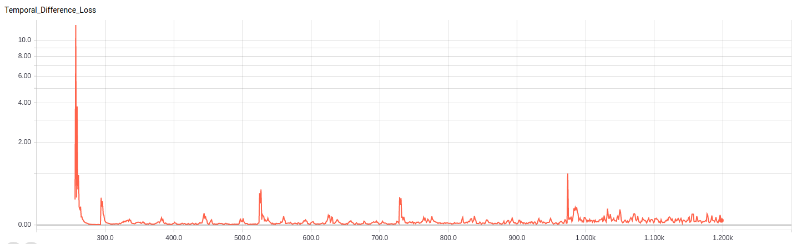
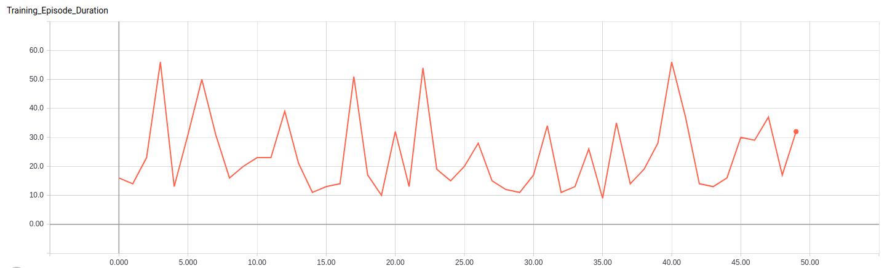

# DQN-Pytorch
A Pytorch implementation of [Human-level control through deep reinforcement learning](https://www.nature.com/articles/nature14236)

### Project structure:
```
├── agents
|  └── dqn.py # the main training agent for the dqn
├── graphs
|  └── models
|  |  └── dqn.py
|  └── losses
|  |  └── loss.py # contains the binary cross entropy
├── datasets  # contains all dataloaders for the project
├── utils # utilities folder containing input extraction, replay memory, config parsing, etc
|  └── assets
|  └── replay_memory.py
|  └── env_utils.py
├── main.py
├── run.sh
```

### Environments:
#### 1. CartPole V0:
Loss during training:



Number of durations per Episode:




### Usage:
- To run the project, you need to add your configurations into the folder configs/ as fround here [here](https://github.com/hagerrady13/DQN-Pytorch/blob/master/configs/dqn_exp_0.json)
- ``` sh run.sh ```
- To run on a GPU, you need to enable cuda in the config file.


### Requirements:
- Pytorch: 0.4.0
- torchvision: 0.2.1
- tensorboardX: 0.8

### To-Do:

- Test DQN on a more complex environment such as MS-Pacman

### References:
- Pytorch official example: https://pytorch.org/tutorials/intermediate/reinforcement_q_learning.html
- pytorch-dqn: https://github.com/transedward/pytorch-dqn/blob/master/dqn_learn.py

### License:
This project is licensed under MIT License - see the LICENSE file for details.